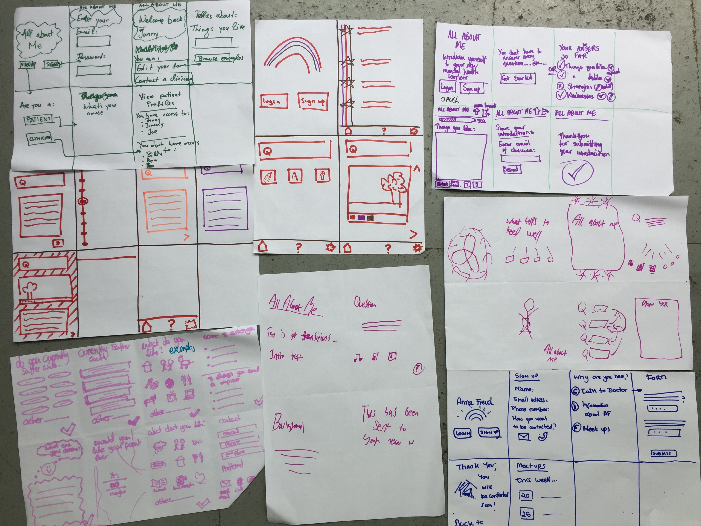
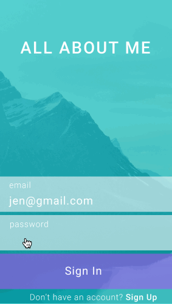

# Design Sprint

Founders and Coders follows design ideas from IDEO and the Google design spring 

__Google__

__IDEO__

## Ideation 

We only had 2 hours of ideation with the product owner so we carried out a condensed ideation process

### Problem Statements

We started by gathering problem statements from the PO:

* Re-telling personal info to multiple clinicians 
* Making young people feel annoyed/triggered/upset
* Paper can be lost
* risk of personal info falling into wrong hands
* young people feel they are wasting their time - they question themselves about why they're having to do the process again/ 
* Unappealing process to fill out and not distinct enough from other people

#### Goals, Stakeholers, What's being done & Inspiration

A short exercise aimed to align the ideas into more concise goals, ultimately picking the key goal and stakeholder from the list generated. 

__Goals__
* Yound people don't have to repeat filling out personal informaion 
* Information automatically gets shared (no need for Anna Freud typing up)
* Make process fun & Appealing
* Make young people feel positive 
* Data is secure
* Services adopt this as standard

_*Final goal: 'To stop young person having to tell their stories to different clinicians whilst transitioning between services and clinicians*_

__Stakeholders__
* Young People
* Therapist/professional
* Parent/guardian
* Young person's peers & network 

_*Final Stakeholder: 'Young Person'*_

__What's currently being done?__
* Paper Questionnaire
* Questions authored by young person 
* Data typed up manually

__Inspiration__
* Happy (previous F&C project)
* tumblr

__Desired outcome: 'To make transitioning easiest and the most efficient and stress free__

#### Crazy 8's
A chance to get design ideas down on paper and finalise a user journey!

### Prototyping 
Following our ideation phase we began prototyping the idea on Figma. 

